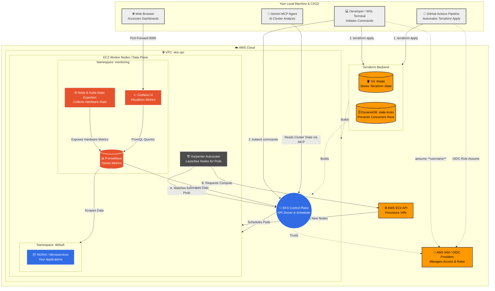

```
eks-terraform-project/
├── main.tf        # The Brain: Where the resources are actually defined.
├── variables.tf   # The Dials: Settings you can change (like region or cluster name).
├── outputs.tf     # The Receipt: Information Terraform gives back (like the Cluster Endpoint).
└── versions.tf    # The Rules: Specifies which version of Terraform/AWS to use.
```

## Architecture design



## Blueprint

```
source  = "terraform-aws-modules/eks/aws"
```

## Run this script to create the Backend

```
export BUCKET_NAME="k8s-terraform-mcp-state-$(aws sts get-caller-identity --query "Account" --output text)"
export REGION="us-east-1"

# 1. Create S3 Bucket
aws s3api create-bucket --bucket $BUCKET_NAME --region $REGION --create-bucket-configuration LocationConstraint=$REGION

# 2. Enable Versioning (Crucial for recovering state if corrupted)
aws s3api put-bucket-versioning --bucket $BUCKET_NAME --versioning-configuration Status=Enabled

# 3. Create DynamoDB Table for Locking
aws dynamodb create-table \
    --table-name terraform-locks \
    --attribute-definitions AttributeName=LockID,AttributeType=S \
    --key-schema AttributeName=LockID,KeyType=HASH \
    --provisioned-throughput ReadCapacityUnits=1,WriteCapacityUnits=1 \
    --region $REGION

```
## Execution

```
terraform init -backend-config="bucket=${BUCKET_NAME}"
terraform plan -out plan.out
terraform apply -auto-approve

# create a temporary "tunnel" from your terminal to the cluster.
kubectl port-forward svc/kube-prometheus-stack-grafana 8080:80 -n monitoring

```

1. Open your web browser and go to: http://localhost:8080
2. Username: admin
3. Get passwd with cmd ```kubectl get secret -n monitoring kube-prometheus-stack-grafana -o jsonpath="{.data.admin-password}" | base64 --decode ; echo```


## Essential Utilities

coredns: It helps applications find each other by name (e.g., "database") instead of IP address.
kube-proxy: It handles network rules on each node.
vpc-cni: It allows your Kubernetes pods to have real AWS IP addresses inside your VPC.

## Karpenter

Karpenter is high performace auto-scaler, it will instantly launches the exact right size servers to handle the work done.
Karpenter needs permission to create and destroy servers

## Security & Access

**enable_cluster_creator_admin_permissions** = true: This ensures that you (the person running the Terraform command) actually have permission to log in and control the cluster after it is created.
**cluster_endpoint_public_access** = true: This opens a secure door on the internet so you can send commands (using kubectl) from your laptop.
**cluster_endpoint_private_access** = true: This opens a door inside your private network so your worker nodes can talk to the brain without going out to the public internet.


## gemini

#### Install the Gemini CLI
```
npm install -g @google/gemini-cli@latest
gemini
```
- Authenticate via your browser using your Google account (this creates your ~/.gemini/settings.json file
***Note:*** Requires Node.js v18 or higher.

#### Configure the Kubernetes MCP Server

Open your configuration file:

```
nano ~/.gemini/settings.json
```

Add the mcpServers block
```
"mcpServers": {
    "kubernetes": {
      "command": "npx",
      "args": [
        "-y",
        "mcp-server-kubernetes"
      ]
    }
  }
```
#### Verify the Connection:

```
gemini
/mcp list
```

#### monitoring

To get grafane passwd
kubectl get secret -n monitoring kube-prometheus-stack-grafana -o jsonpath="{.data.admin-password}" | base64 --decode ; echo

## troubleshoot

update your ~/.kube/config file to include the --profile sran-nice argument automatically
```
rm ~/.kube/config

aws eks update-kubeconfig --region us-east-1 --name edge-cluster

# try later with user name
aws eks update-kubeconfig --region us-east-1 --name edge-cluster --profile <profile_name>

e.g: aws eks update-kubeconfig --region us-east-1 --name edge-cluster --profile test-user

```

### Error: "the server has asked for the client to provide credentials"
This indicates your AWS credentials have expired or your system clock is out of sync.
1. Refresh credentials: `aws sso login`
2. Sync clock (WSL): `sudo hwclock -s`
3. Update kubeconfig: `aws eks update-kubeconfig --region us-east-1 --name edge-cluster`

### Manual Cleanup (CLI)
If Terraform state is lost, use these commands to clean up (ensure you are in `us-east-1`):

```bash
export AWS_REGION=us-east-1
export CLUSTER_NAME=edge-cluster

# 1. Delete Node Groups
aws eks list-nodegroups --cluster-name $CLUSTER_NAME --query 'nodegroups[*]' --output text | xargs -r -n1 aws eks delete-nodegroup --cluster-name $CLUSTER_NAME --nodegroup-name

# 2. Terminate Instances (Karpenter/Nodes)
aws ec2 describe-instances --filters "Name=tag:kubernetes.io/cluster/$CLUSTER_NAME,Values=owned" --query 'Reservations[*].Instances[*].InstanceId' --output text | xargs -r aws ec2 terminate-instances --instance-ids

# 3. Delete Load Balancers
aws elbv2 describe-load-balancers --query "LoadBalancers[?contains(DNSName, '$CLUSTER_NAME')].LoadBalancerArn" --output text | xargs -r -n1 aws elbv2 delete-load-balancer --load-balancer-arn

# 4. Delete Cluster (Wait for nodes to terminate first!)
aws eks delete-cluster --name $CLUSTER_NAME

# 5. Delete NAT Gateways (Find VPC ID first)
VPC_ID=$(aws ec2 describe-vpcs --filters "Name=tag:Name,Values=eks-vpc" --query 'Vpcs[0].VpcId' --output text)
aws ec2 describe-nat-gateways --filter "Name=vpc-id,Values=$VPC_ID" --query 'NatGateways[*].NatGatewayId' --output text | xargs -r -n1 aws ec2 delete-nat-gateway --nat-gateway-id
```

### AWS Login in WSL
If `aws sso login` fails to open a browser:
1. Install wslu: `sudo apt install wslu`
2. Set browser: `export BROWSER=wslview`
3. Sync clock: `sudo hwclock -s`

